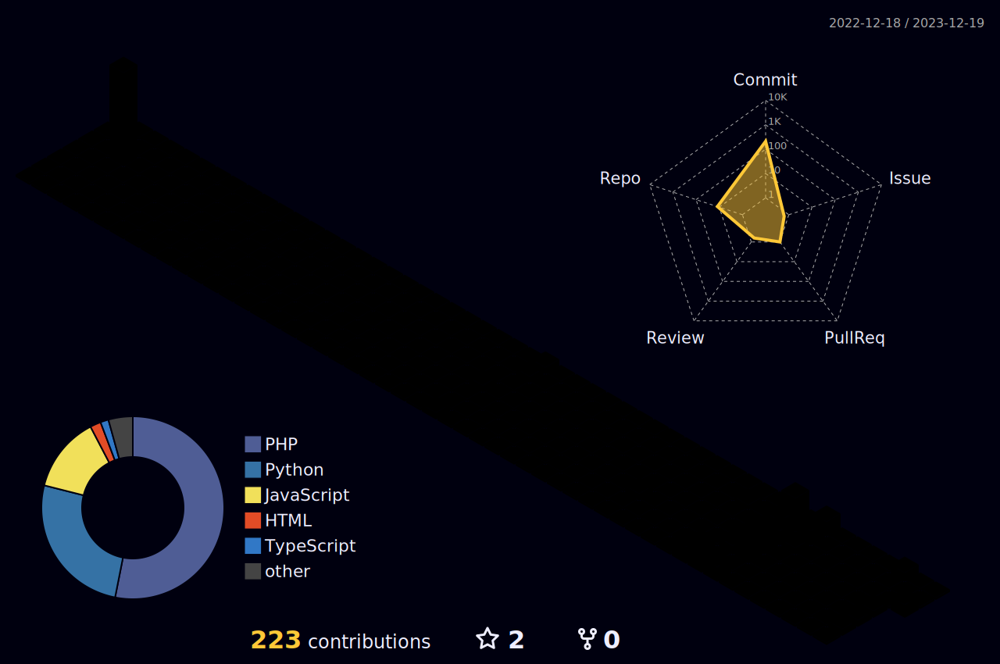

<!--  -->

# 김남령 (Namryeong Kim)

  
  
  
  
안녕하세요 ✨

  
 누구나 쉽게 보안을 접하고 관심 가질 수 있도록 경험과 지식을 공유하는 사람이 되고 싶은 김남령입니다.

	  

 

## Github Stat

---
## Skills

  
 Social 

  
  
  
  
  

  
 Language 

  
  
  
  
  
  
  

  
 OS 

  
  
  

  
Tools

  
  
  
  
  
  

	

<!--  -->

